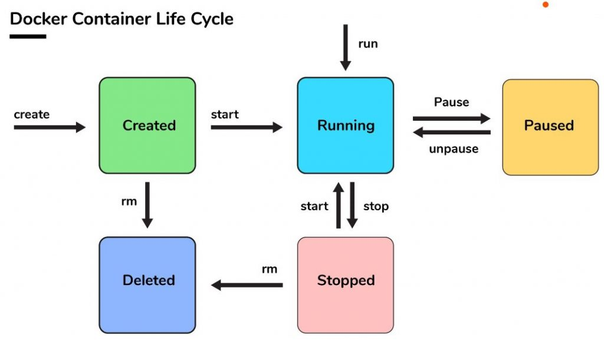

# Docker Client
Next we will see the most used lifecycles and commands in Docker.

Table of contents:
- [Docker Client](#docker-client)
  - [Container life cycle](#container-life-cycle)
  - [Image lifecycle](#image-lifecycle)
  - [Main commands](#main-commands)
    - [--help](#--help)
    - [docker tag](#docker-tag)
    - [docker pull](#docker-pull)
    - [docker images](#docker-images)
    - [docker push](#docker-push)
    - [docker run](#docker-run)
    - [docker commit](#docker-commit)
    - [docker inspect](#docker-inspect)
    - [docker rmi](#docker-rmi)
    - [docker rm](#docker-rm)
    - [docker ps](#docker-ps)
    - [Save and restore containers or images](#save-and-restore-containers-or-images)
    - [docker build](#docker-build)


## Container life cycle
This is the simplified life cycle, pointing out the most relevant states and commands as a starting point:


- Created: a Docker container is created from a Docker image.
- Running: the Docker container starts. This status can also be reached by using run command. This command creates the container if it is not present.
- Paused: the running container is paused. When we unpause it, the container continues execution.
- Stopped: the main process of the container is closed correctly
- Deleted: the container is deleted.

Please not that a container can also be killed, by using kill command.


## Image lifecycle


## Main commands
| Docker Command | Description                                     |
| -------------- | ----------------------------------------------- |
| docker pull    | Downloads an image from a registry.              |
| docker push    | Uploads an image to a registry.                  |
| docker build   | Builds an image from a Dockerfile.               |
| docker images  | Lists all Docker images on the computer.        |
| docker run     | Executes an image, creating an instance.        |
| docker ps      | Lists all started and stopped instances.        |
| docker start   | Starts an instance.                             |
| docker stop    | Stops an instance.                              |
| docker rm      | Removes an instance.                            |
| docker rmi     | Deletes an image.                               |
| docker tag     | Creates a tag for an image.                     |

### --help
Review the options of the any of the above commands by using --help:
```bash
$ docker images --help
```


### docker tag
For the purpose of this tutorial, the name of an image is composed of:

`image_name = [registry_host:[port]/][registry_name/]repository_name[:tag]`

To tag an image, we use the `docker tag` command:
```bash
$ docker tag <source_image_name> <target_image_name>
```

Example:
```bash
$ docker tag namespace1/docker101tutorial new_namespace/docker101tutorial
```

The name of a tag should contain valid ASCII characters, which can be lowercase or uppercase letters, digits, and separators. A separator can be a period, one or two underscores, one or more hyphens. A tag cannot start with a separator, and its maximum length can be 128 characters.


### docker pull
Download an image or repository from a registry:
```bash
$ docker pull <image_name>
```

Example:
```bash
docker pull alpine:3.19.0
```

To download all versions of an image, use the --all-tags or -a option.

### docker images

To list all images (including intermediate ones), use the --all or -a parameter:
```bash
$ docker images -a
```

List images by name and tag:
```bash
$ docker images <repository_name>:<image_tag>
$ docker images alpine:3.1*
```

List images with filters using the --filter parameter:
```bash
$ docker images --filter=reference='alpin*'
$ docker images --filter=reference='alpin*' --filter=reference='busibox'
```

Format the output of the docker images command:
```bash
$ docker images --format "{{.ID}}: {{.Repository}}"
```

### docker push
Push an image or repository to a registry

```bash
$ docker push <repository_name>:<image_tag>
```

Example:

```bash
$ docker push new_namespace/docker101tutorial
```

Push all images from a repository with the --all-tags or -a option:

```bash
$ docker push --all-tags <repository_name>
```

### docker run
Create a new writable layer in the container image and start it using the specified command.
```bash
$ docker run [options] <image_name> [command] [args]
```
Among the most common options are:

- `detach/d`: Run the container in the background.
- `env/e`: Set environment variables in the container.
- `expose`: Expose a port or range of ports from the container.
- `name`: Assign a name to the container.
- `rm`: Remove the container as soon as it finishes.
- `tty/t`: Enable a pseudo-TTY (TeleTYpewriter).
- `workdir/w`: Set the working directory inside the container.


```bash
$ docker run --name test -it alpine:3.7
```

### docker commit
Create a new image from the changes made in a container.
```bash
$ docker commit [options] <container> [repository:[tag]]
```

Example 1:
```bash
$ docker commit container_name new_image_name:example
```

Example 2:
```bash
$ docker inspect -f "{{ .Config.Env }}" <container_id>
$ docker commit --change "ENV DEBUG=true" <container_id> new_image_name:example
$ docker inspect -f "{{ .Config.Env }}" <new_container_id>
```
Example 2 inspects the Environment Variables of the original container. It retrieves and displays the environment variables. Then, it creates a new Docker image based on the changes made to the specified container. In this case, it adds a new environment variable DEBUG=true. Finally, it inspects and displays the environment variables of the newly created container from the new image, to ensure that they are the same as the original container.

### docker inspect
Provides detailed information about an object built by Docker.
```bash
$ docker inspect [options] <container> [container…]
```

With the --type option, you can specify the type of the object.
```bash
--type container|image|node|network|secret|service|volume|task|plugin
```

Example:
```bash
$ docker inspect size <container>
$ docker inspect size database --format '{{ .SizeRootFs }}'
$ docker inspect size database --format '{{ .SizeRw }}'
```

Note: The provided examples demonstrate inspecting the size of a container and retrieving specific size-related information.


### docker rmi
Deletes one or more images using their ID (short or long), tag, or digest. If an image has more than one tag referencing it, all tags must be removed before the image itself can be deleted.
```bash
$ docker rmi <repository_name>:<image_tag>|<image_id>|<digest>
```

- This does not delete images from a registry.
- You cannot delete an image from a running container unless you use the -f option.
- With the -f option, if the ID (short or long) is specified, all tags for the image are removed, and the image is deleted.
```bash
$ docker rmi -f <image_id>
```

### docker rm
Deletes one or more containers using their ID (short or long) or their name.
```bash
$ docker rm <container_id>|<container_name>
```

With the -f option, if the ID (short or long) is specified, all containers are forcefully removed, forcing the termination of those currently running.
```bash
$ docker rm -f <container_id>|<container_name>
```

### docker ps
Lists containers, by default only those that are currently running. With the -a or --all option, it lists all containers.
```bash
$ docker ps --all
$ docker container ps --all
```

With the --filter option, it lists containers according to the given conditions. The most common conditions are:

- status: with a value of created, restarting, running, removing, paused, exited, or dead.
- health: with a value of starting, healthy, unhealthy, or none.
```bash
$ docker ps --filter status=running
$ docker container ls --filter "name=local*"
```

### Save and restore containers or images
Exports the content of the filesystem of a container. The --output or -o option is used to name the output file.
```bash
$ docker export --output=<filename.tar> <container_id|name>
```

Saves one or more images to a tar file. The --output or -o option is used to name the output file.
```bash
$ docker save -o <filename.tar> <image_id|name>
```
Imports the content of the filesystem saved in a tar file from a container to an image.
```bash
$ docker import <from_file|url> <image_name>
```

Loads images from a tar file. The --input or -i option is used to specify the name of the tar file from which the images will be loaded.
```bash
$ docker load -i <filename.tar>
```

### docker build
Build an image from a Dockerfile and a context. The context for the build command is a set of files located in the specified path or URL.

```
$ docker build [options] <dockerfile_path>|<url>
```

When the URL points to a Git repository, the repository serves as the context for the build command. In the following example, the snippet indicates the container branch and the docker folder as the context.
```
$ docker build https://github.com/docker/rootfs.git#container:docker
```
Additionally, you can tag images and assign values to arguments during the build process.

To build an image with one or more tags, use the -t or --tag option.
```
$ docker build -t repo1/micro1:v1 -t repo2/micro1:v1 .
```

To assign values to arguments, use the --build-arg option.

```
$ docker build --build-arg DEST_FOLDER=my_folder.
```