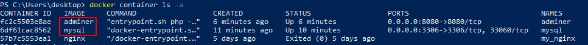
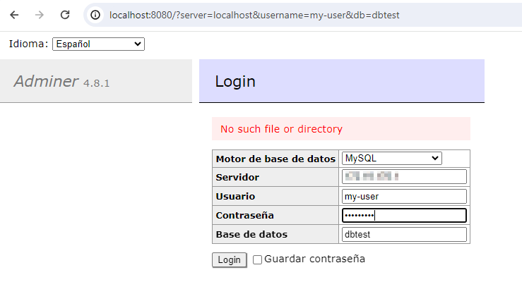
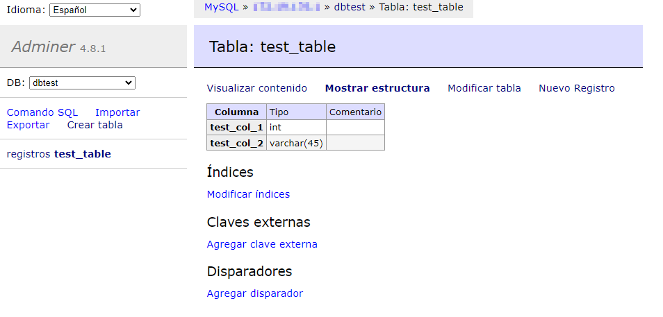
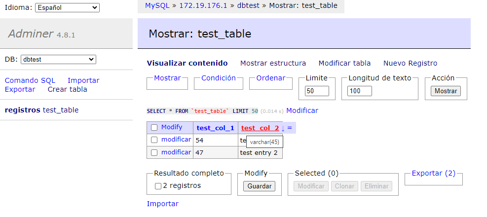

# Exercises
## Exercise 1 (slides 78-81)

### Run MySQL and Adminer
Download the image MySQL from Docker Hub:
```bash
$ docker run --name mysql -e MYSQL_ROOT_PASSWORD=my-root-pwd -e MYSQL_USER=my-user -e MYSQL_PASSWORD=my-sqlpwd -e MYSQL_DATABASE=dbtest -d -p 3306:3306 mysql
```
When we execute this command, it creates and runs a MySQL container named "mysql" with the specified configuration, including setting up the root password, creating a non-root user, setting up a password for that user, creating a database, and mapping the MySQL port to the host machine.

Components of the command:
- `--name mysql`: This option assigns a name to the container.
- `-e MYSQL_ROOT_PASSWORD=my-root-pwd`: This sets the environment variable `MYSQL_ROOT_PASSWORD` inside the container to the specified value ("my-root-pwd"). This is the password for the MySQL root user.
- `-e MYSQL_USER=my-user`: This sets the environment variable `MYSQL_USER` to the specified value ("my-user"). This is used to create a non-root user in the MySQL database.
- `-e MYSQL_PASSWORD=my-sqlpwd`: This sets the environment variable `MYSQL_PASSWORD` to the specified value ("my-sqlpwd"). This is the password for the non-root MySQL user (`MYSQL_USER`).
- `-e MYSQL_DATABASE=dbtest`: This sets the environment variable `MYSQL_DATABASE` to the specified value ("dbtest"). This is the name of the database that will be created in the MySQL server.
- `-d`: This option runs the container in the background (detached mode).
- `-p 3306:3306`: This maps port 3306 on the host to port 3306 on the container. Port 3306 is the default port for MySQL, and this allows you to access the MySQL server running inside the container from your host machine.
- `mysql`: This specifies the Docker image to use for creating the container. In this case, it's the official MySQL Docker image.

Download the adminer image from Docker Hub and run it in a detached mode:
```bash
$ docker run --name adminer -d -p 8080:8080 adminer
```



### Create data inside the container
Connect to MySQL using Adminer (http://localhost:8080 or http://<local-ip>:8080). 


Try creating a table and inserting records.




### Check data persistance
Delete the containers:
```bash
$ docker stop fc2
$ docker rm fc2
$ docker stop 6df
$ docker rm 6df
```

Re-run the previous instructions, and check if the table and inserted records still exist. The table and inserted records do not exist, because the data was stored inside the container, including the database, tables, and records I created. Containers data is not persisted by default.


### Implement data persistance
Recreate the containers, but this time create volumes for the MySQL configuration file (/etc/mysql/conf) and the MySQL data directory (/var/lib/mysql).

1. **Create Docker Volumes:**
   Before running the containers, create Docker volumes for MySQL data and configuration.

   ```bash
   docker volume create mysql_data
   docker volume create mysql_config
   ```

2. **Run MySQL Container with Volumes:**
   Run the MySQL container while mounting the volumes for data and configuration.
   ```bash
   docker run --name mysql -v mysql_data:/var/lib/mysql -v mysql_config:/etc/mysql/conf.d -e MYSQL_ROOT_PASSWORD=my-root-pwd -e MYSQL_USER=my-user -e MYSQL_PASSWORD=my-sqlpwd -e MYSQL_DATABASE=dbtest -d -p 3306:3306 mysql
   ```

3. **Run Adminer Container:**
   Run the Adminer container as I did before.
   ```bash
   docker run --name adminer -d -p 8080:8080 adminer
   ```

4. **Connect, Create Table, Insert Records:**
   Connect to MySQL using Adminer (http://localhost:8080 or http://<local-ip>:8080), create a table, and insert records.

5. **Stop and Remove Containers:**

   ```bash
   docker stop mysql adminer
   docker rm mysql adminer
   ```

6. **Run Containers Again:**
   Make sure to use the same volume mounts. The tables and data will be there.

   ```bash
   docker run --name mysql -v mysql_data:/var/lib/mysql -v mysql_config:/etc/mysql/conf.d -e MYSQL_ROOT_PASSWORD=my-root-pwd -e MYSQL_USER=my-user -e MYSQL_PASSWORD=my-sqlpwd -e MYSQL_DATABASE=dbtest -d -p 3306:3306 mysql
   docker run --name adminer -d -p 8080:8080 adminer
   ```

By using Docker volumes, the data inside the MySQL container (including the database, tables, and records) will be stored on the host machine and will persist across container removals.


## Exercise 2 (Slides 89-92)
Pending

## Exercise 3
- Check again dockerfile examples.