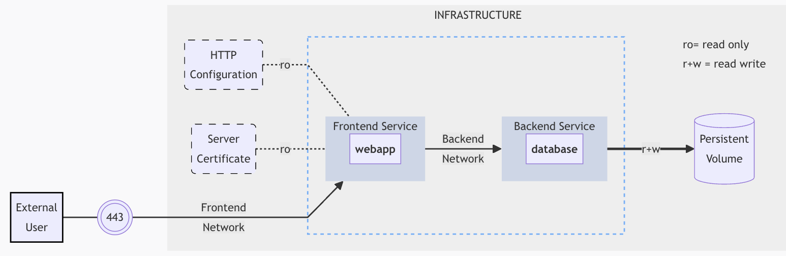

# Docker Compose
Table of contents
- [Docker Compose](#docker-compose)
  - [What is Docker Compose?](#what-is-docker-compose)
  - [Commands for docker-compose.yaml file](#commands-for-docker-composeyaml-file)
    - [Commands in detail](#commands-in-detail)
  - [Docker Compose File Structure](#docker-compose-file-structure)
    - [File Example](#file-example)
    - [Services Section: Common Directives](#services-section-common-directives)
  - [Docker Compose Examples](#docker-compose-examples)
    - [Example 1 - Basics with nginx, php and mysql](#example-1---basics-with-nginx-php-and-mysql)
    - [Example 2 - Replicate mysql and adminer example](#example-2---replicate-mysql-and-adminer-example)


In this section, we will explore how to define and run multiple applications in containers easily and quickly using Docker Compose.

## What is Docker Compose?

Docker Compose is a tool designed for defining and running applications with multiple containers as if they were a single service. It allows you to create a file to define various containers and start them all with a single command.

- Docker Compose files are written using the YAML (Yet Another Markup Language) format.
- For example, if you have an application that requires an NGINX server and a Redis database, you can create a Docker Compose file and run both as a service without the need to start each one separately.

## Commands for docker-compose.yaml file

| Command    | Description                                                  |
|------------|--------------------------------------------------------------|
| **up**     | Initiates all services (containers).                         |
| **down**   | Stops all services.                                          |
| **build**  | Validates that the images are ready, building any missing images. |
| **images** | Lists the images specified in the docker-compose.yaml file.  |
| **stop**   | Stops the containers for the services contained in docker-compose.yaml. |
| **run**    | Creates containers for the specified services in docker-compose.yaml. |
| **ps**     | Lists all containers specified in docker-compose.yaml.       |
| **pause**  | Pauses all containers specified in docker-compose.yaml.      |
| **unpause**| Resumes previously paused containers.                         |
| **logs**   | Displays the logs for the specified service's output.        |


These commands provide flexibility and efficiency in managing multi-container applications using Docker Compose.

### Commands in detail

To create and start the resources described in the `docker-compose.yaml` file, use the following command:

```bash
$ docker-compose up
```

Some options include:

- **detach/d:** Runs the containers in the background.
- **build:** Always builds the images even if they already exist.
- **force-recreate:** Forces the recreation of containers even if specifications haven't changed.
- **v/renew-anon-volumes:** Recreates anonymous volumes instead of retaining data from previous ones.
- **no-deps:** Avoids the creation of linked (dependent) containers.
- **scale:** Scales a service to a specified number of instances (replicas in `docker-compose.yaml`).

Examples:

```bash
$ docker-compose up -d # Starts the containers in the background.
$ docker-compose up nginx # Starts the nginx and mysql containers.
$ docker-compose up mysql # Starts only the mysql container.
```
If we are only going to create and start one of the containers, we must take into account the dependencies. When creating and starting one containers, the ones that depend on it will also be created and started.


To start the created containers:

```bash
$ docker-compose start [SERVICE…]
```

To display containers, including stopped ones:

```bash
$ docker-compose ps -a
```

To enter a container, for example, the php container:

```bash
$ docker exec -ti test_php bash
```

To stop active services while preserving containers, volumes, networks, and any modifications:

```bash
$ docker-compose stop
```

To discard changes and destroy everything:

```bash
$ docker-compose down
```


## Docker Compose File Structure

Docker Compose files operate by applying multiple commands declared within a `docker-compose.yaml` file. The basic structure of this file is as follows:

```yaml
version: "X"  # Optional starting from version 1.27.0
services: ...
volumes: ...
networks: ...
configs: ...
secrets: ...
```

- **Services:** Defines the configuration for containers.

- **Volumes:** Represents physical disk areas shared between the host and the server.

- **Networks:** Specifies communication rules between containers and the server.

- **Configs:** Stores non-sensitive information, such as configuration files outside of the images.

- **Secrets:** Serves as a storage mechanism for sensitive information like certificates, keys, etc.

This structure provides a comprehensive overview of the key components within a Docker Compose file, facilitating the configuration of containers and their associated resources. Each section plays a specific role in orchestrating and defining the behavior of the containers and their interactions.

### File Example
Here is an example Docker Compose file illustrating the configuration for a web application and a database:




```yaml
services:
  frontend:
    image: example/webapp
    ports:
      - "443:8043"
    networks:
      - front-tier
    configs:
      - httpd-config
    secrets:
      - server-certificate

  backend:
    image: example/database
    volumes:
      - db-data:/etc/data
    networks:
      - back-tier

volumes:
  db-data:
    driver: flocker
    driver_opts:
      size: "10GiB"

configs:
  httpd-config:
    external: true

secrets:
  server-certificate:
    external: true

networks:
  front-tier: {}
  back-tier: {}
```

**Key Components of the Example:**
- Two services, backed by Docker images: `webapp` and `database`.
- One secret (HTTPS certificate) injected into the `frontend`.
- One configuration (HTTP) injected into the `frontend`.
- One persistent volume connected to the `backend`.
- Two networks: `front-tier` and `back-tier`.

This example provides a comprehensive configuration, showcasing the integration of services, secrets, configurations, volumes, and networks within a Docker Compose file. Adjustments can be made based on specific application requirements.

### Services Section: Common Directives
In the services section of a Docker Compose file, various directives are commonly used to configure and define the behavior of containers. Here are some key directives:

| Directive         | Description                                                                                                       |
|-------------------|-------------------------------------------------------------------------------------------------------------------|
| **image**        | Configures the image and version used to build the container. Assumes the image is available on the server or Docker Hub.  |
| **build**        | Can be used instead of the image. Specifies the location of the Dockerfile for building the container.              |
| **container_name**| Defines a name for the container, corresponding to the service name.                                                |
| **volumes**      | Mounts a linked path on the server for use by the container.                                                        |
| **environment**  | Defines environment variables to be passed to the container.                                                        |
| **depends_on**   | Configures a service as a dependency, ensuring some services are loaded before others.                              |
| **ports**        | Maps a port from a container to the server using the structure `host_ip:container_ip`.                               |
| **links**        | Links this service to any other service in the docker-compose file by specifying their names.                        |

Docker Compose operates within a directory structure. You can have multiple groups of containers on a server—create a directory for each container and a `docker-compose.yaml` file for each directory. This modular approach allows for flexibility and organization in managing containerized applications.


## Docker Compose Examples
### Example 1 - Basics with nginx, php and mysql

```yaml
version: "3.9"
services:
  nginx:
    image: nginx:1.23.3
    container_name: test_nginx
    ports:
      - "80:80"
      - "443:443"
    volumes:
      - ./repo:/var/www
      - ./nginx/nginx.conf:/etc/nginx/nginx.conf
      - ./nginx/ssl:/etc/nginx/ssl/
    working_dir: /var/www
    links:
      - php

  php:
    image: php:8.1.0-fpm
    container_name: test_php
    volumes:
      - ./repo:/var/www
    working_dir: /var/www
    links:
      - mysql

  mysql:
    image: mysql:5.7.36
    container_name: test_mysql
    ports:
      - "3306:3306"
    volumes:
      - ./mysql:/var/mysql
    environment:
      - MYSQL_ROOT_PASSWORD=root_password
```

**Create and Start Containers:**
```bash
$ docker-compose up -d # Start the containers in the background.
$ docker-compose up nginx # Start the nginx and mysql containers.
$ docker-compose up mysql # Start only the mysql container.
```
**Start Created Containers**
```bash
$ docker-compose start [SERVICE…] # Start the specified service containers.
```

**Display Containers:**
```bash
$ docker-compose ps -a # Show containers (including stopped ones).
```
```
Output:
PS C:\...\Docker-Essentials\Compose\example_01> docker-compose ps -a
NAME         IMAGE           COMMAND                  SERVICE   CREATED          STATUS          PORTS
test_mysql   mysql:5.7.36    "docker-entrypoint.s…"   mysql     11 minutes ago   Up 11 minutes   0.0.0.0:3306->3306/tcp, 33060/tcp
test_nginx   nginx:1.23.3    "/docker-entrypoint.…"   nginx     11 minutes ago   Created         0.0.0.0:80->80/tcp, 0.0.0.0:443->443/tcp
test_php     php:8.1.0-fpm   "docker-php-entrypoi…"   php       11 minutes ago   Up 11 minutes   9000/tcp
```
    

**Enter a Container:**
To access a container, for example, the php container, execute the following command:
```bash
$ docker exec -ti test_php bash
```

**Stop Services:**
To stop active services while preserving containers, volumes, networks, and any modifications, run the following command:
```bash
$ docker-compose stop
```


**Destroy Everything:**
If you want to discard changes and destroy all resources, execute:
```bash
$ docker-compose down
```

### Example 2 - Replicate mysql and adminer example
We will do it with permanent storage. Our docker-compose.yaml is:
```yaml
version: '3.9'

services:
  mysql:
    image: mysql:latest
    container_name: mysql-container
    environment:
      MYSQL_ROOT_PASSWORD: my-root-pwd
      MYSQL_DATABASE: dbtest
      MYSQL_USER: my-user
      MYSQL_PASSWORD: my-sqlpwd
    # ports: # This is not necessary, we do not need to expose the ports for mysql, because adminer will communicate with it.
    #  - "3306:3306"
    volumes:
      - mysql-data:/var/lib/mysql

  adminer:
    image: adminer:latest
    container_name: adminer-container
    ports: 
      - "8080:8080"
    depends_on:
      - mysql

volumes:
  mysql-data:
```

Create and start containers and display them:
```bash
$ docker-compose up -d
$ docker-compose ps -a
```
The status of the containers is "Up".

Access the website http://localhost:8080/, and log in by indicating the following connection parameters in Adminer:
- **Server:** `mysql` (this is the service name in the `docker-compose.yaml`)
- **Username:** `my-user`
- **Password:** `my-sqlpwd`
- **Database:** `dbtest`

Create a test table in Adminer. Add test values.

Stop Services and destroy everything:
```bash
$ docker-compose stop
$ docker-compose down
```

Now recreate and restart containers:
```bash
$ docker-compose up -d
```
Access the website http://localhost:8080/, log in and check if the created table and values still remain. We see that this content is still there because in the yaml we have specified to save the information in a volume.

We can view the volume created by doing 
```bash
$ docker volume ls
$ docker volume inspect <volume-name>
```
